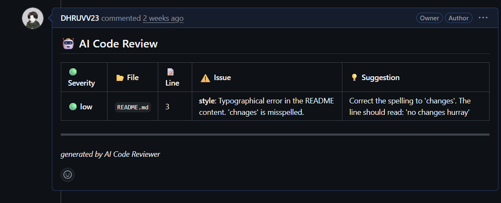

# 🤖 AI Code Reviewer

An automated code review assistant that integrates directly with **GitHub Pull Requests**.

### What it does
Instead of waiting hours for a human review, this bot listens for new Pull Requests and instantly analyzes the code changes using **Google Gemini AI**. It detects bugs, security risks, and style issues, posting constructive feedback in a clean, easy-to-read table directly on your PR.

It handles:
* **Real-time Analysis:** Triggers automatically when a PR is opened or updated.
* **Smart Feedback:** Catches logic errors and suggests optimizations.
* **Duplicate Prevention:** intelligently checks history to avoid spamming the same comments.

### See it in Action
The bot posts feedback in a clean, easy-to-read table directly on your PR.

